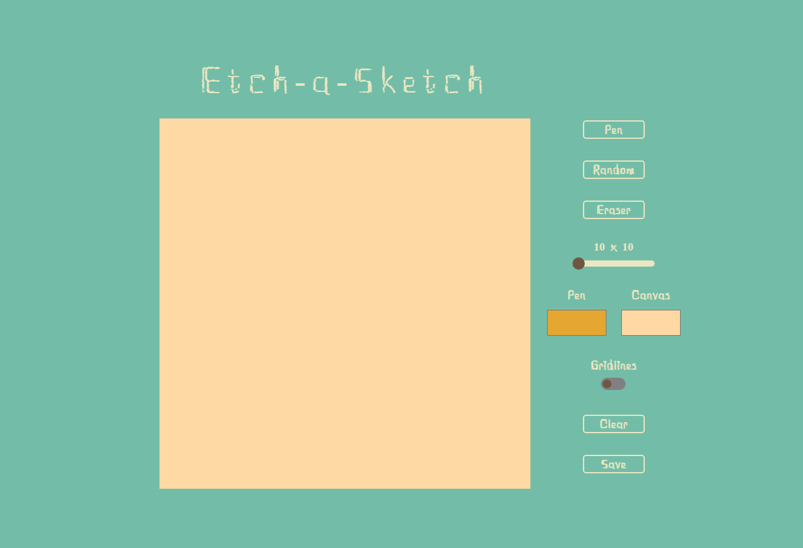

# Project: Etch-a-Sketch

## Overview

Welcome to my implementation of the classic children's drawing toy. This web application provides users with a digital canvas where they can unleash their creativity and create artworks or doodles. Inspired by the iconic toy, this project serves as both a practical exercise in JavaScript programming and an opportunity to explore functions and event listeners.

You can unleash your creativity [here](https://krig6.github.io/etch-a-sketch/).

## Visual Overview

## Sample Art

## Technologies Used

- HTML: Provides the structure and layout of the web page.
- CSS: Styles the elements on the page for a visually appealing interface.
- JavaScript: Implements the interactive features and functionality of the Etch-a-Sketch.

## Features

- Drawing Tools: Choose from a pen, eraser, or random color generator to create your masterpiece.
- Canvas Customization: Adjust the canvas size and background color to suit your preferences.
- Gridlines: Enable gridlines for precise drawing and alignment.
- Clear Canvas: Start fresh by clearing the canvas with the click of a button.

## Learning Path

In the process of developing this project, I encountered various challenges that deepened my understanding of JavaScript functions and event listeners. One particular problem involved implementing the clicking logic for each button, where the first click will initiate coloring, and hovering continued the coloring process, while the second click stops it. Overcoming this hurdle required sweat, tears and learning from external resources. I watched tutorials and examined other developers' code to gain insights. Through this process, I not only resolved the issue of button overlap and compromised functionality but also enhanced my proficiency in JavaScript programming. This experience reinforced the importance of resourcefulness and continuous learning in my journey as a developer.

## Future Enhancements

- Responsive Design: Implement responsive design for accessibility across different devices, ensuring a seamless user experience on desktops, laptops, tablets, and smartphones.
